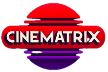

# Cinematrix

A web application for recommending movies.

## Project Description
Cinematrix is a web application for tracking movies you have watched as well as parts about them that you enjoyed. You can rate movies, favorite genres, actors, directors and so on. 

The application will use this information to give recommendations for good movie candidates to choose from for your next film experience. We also offer the ability to filter through a database of movies in case the recommendations just aren't hitting right. 

## Getting started

If you do not have **Node.js**, install that using nvm:

```bash
nvm install node
```

Then, navigate to the project folder and install dependencies:

```bash
npm i
```

To run the application; run the (development) server:

```bash
npm run dev
```

Then open [http://localhost:3000](http://localhost:3000) with your browser to see the application.

## Usage Overview

### Creating a user
After opening the application, you will be sent to the login page. 
Here you can either choose to create a user, or login using an existing one.


### Marking movies as seen
After logging in, you will be presented with a front page containing some movies. You can mark these as seen using the eye symbol at the bottom left of each movie card.


### Your profile
By clicking on the profile icon in the upper right, you can view the movies you have marked as seen.

## Built with
- [Next.js](https://nextjs.org/) project bootstrapped with [`create-next-app`](https://github.com/vercel/next.js/tree/canary/packages/create-next-app).
- [Typescript](https://www.typescriptlang.org/) for the frontend and backend
- [TailwindCSS](https://tailwindcss.com/) to style the application
- [Firebase](https://firebase.google.com/) to host the database for this application
- [`next/font`](https://nextjs.org/docs/basic-features/font-optimization) to automatically optimize and load Inter, a custom Google Font.

## Project status

The project is being created for the subject **TDT4140 - Programvareutvikling** as a group project. It is still in development.

## Contributors: 
- @annikasr
- @haraljst 
- @lassedi 
- @madsab
- @niklasu
- @sebasmu
- @syndys


